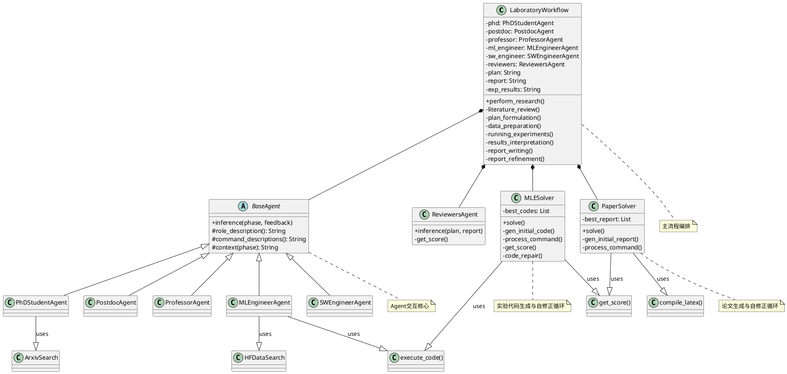

# AgentLaboratory 项目解读报告

## 0. 项目概览

-   **项目名称**: Agent Laboratory
-   **核心理念**: 一个端到端的自动化研究工作流，旨在通过LLM驱动的自治Agent（智能体）来辅助人类研究员完成从想法构思到论文发表的全过程。它并非要取代研究员的创造力，而是通过自动化重复性、耗时长的任务（如代码编写、文献回顾、报告撰写）来加速科学发现。
-   **技术栈与主要依赖**:
    -   **后端**: Python
    -   **LLM 交互**: OpenAI API, DeepSeek API, Google Gemini API
    -   **核心库**: `transformers`, `datasets` (Hugging Face), `torch`, `scikit-learn`, `arxiv`, `semanticscholar`
    -   **报告生成**: LaTeX (`pdflatex`)
    -   **配置管理**: YAML
-   **目录结构概览**: 项目采用扁平化的结构，核心逻辑主要由根目录下的多个 Python 文件构成。
    -   `ai_lab_repo.py`: 项目主入口和工作流编排器。
    -   `agents.py`: 定义了不同角色的Agent（如PhD、教授、工程师）及其行为。
    -   `mlesolver.py`: 负责实验代码生成、测试、评分和修复的智能求解器。
    -   `papersolver.py`: 负责LaTex论文撰写、编译、评分和修改的智能求解器。
    -   `tools.py`: 提供了Agent可用的外部工具，如代码执行、Arxiv搜索、HuggingFace数据集搜索。
    -   `utils.py`: 包含各类辅助函数，特别是LLM API调用和LaTeX编译。
    -   `app.py`: (AgentRxiv功能) 一个Flask应用，用于在多个Agent Lab之间共享研究成果。
    -   `experiment_configs/`: 存放实验配置的YAML文件。
    -   `state_saves/`: 用于保存工作流状态，以便中断后恢复。

## 1. 项目架构设计

### 1.1. 系统整体架构

Agent Laboratory 的架构核心是一个**分阶段、多Agent协作**的流水线系统。整个研究过程被划分为多个定义清晰的阶段，每个阶段由专门的Agent或Agent组合负责。系统通过状态机（`LaboratoryWorkflow`）来驱动流程，Agent之间的交互高度结构化，通过特定的**命令（Command）**来调用工具或传递产物。

其核心架构可以概括为以下几点：

1.  **分阶段工作流 (Phased Workflow)**: `LaboratoryWorkflow` 类将复杂的研究任务分解为线性的几个主要阶段：
    -   文献综述 (Literature Review)
    -   计划制定 (Plan Formulation)
    -   实验 (Experimentation)
    -   结果解读与报告撰写 (Results Interpretation & Reporting)
    这种设计使得每一步的目标都非常明确，易于管理和自动化。

2.  **角色扮演的多Agent系统 (Role-Playing Multi-Agent System)**: 系统通过模拟一个科研实验室的组织结构来分配任务。每个 `Agent`（`ProfessorAgent`, `PhDStudentAgent`, `MLEngineerAgent` 等）都有明确定义的角色和职责，并在特定阶段被激活。这种设计使得复杂的协作可以通过模拟人类世界的交互（如"教授指导博士生"）来简化。

3.  **命令驱动的交互 (Command-Driven Interaction)**: Agent与系统或其他Agent的交互不是通过自由对话，而是通过格式化的命令（如 ````EDIT````, ````PLAN````, ````SUBMIT_CODE````）进行的。`ai_lab_repo.py` 中的主循环解析这些命令，并触发相应的工具执行或状态流转，保证了系统的确定性和可控性。

4.  **"提议-测试-评分-反思"的自修正循环 (Propose-Test-Score-Reflect Loop)**: 这是项目最核心和最亮眼的设计，体现在 `MLESolver` 和 `PaperSolver` 中。
    -   **提议(Propose)**: LLM Agent提出对代码或论文的修改。
    -   **测试(Test)**: 系统自动执行代码或编译LaTeX，验证其有效性。
    -   **评分(Score)**: 另一个LLM（作为奖励模型）根据预设标准（如是否符合计划、结果质量）对产出物进行打分。
    -   **反思/修复(Reflect/Repair)**: 如果测试失败，LLM会尝试自动修复错误；如果成功，高分结果会被保留，LLM还可以对结果进行"反思"，为下一步改进提供思路。

5.  **知识共享与累积 (Knowledge Sharing & Accumulation)**:
    -   **内部**: 各阶段的产物（如文献综述、计划、代码、结果）被保存在 `LaboratoryWorkflow` 实例的状态中，并作为后续阶段的上下文输入，保证了信息在流程中的顺畅传递。
    -   **外部 (`AgentRxiv`)**: 通过一个本地Web服务，不同的Agent Lab可以发布和检索彼此的研究论文，实现了跨任务的知识累积，模拟了科学界的"发表-引用"机制。

### 1.2. 整体架构PlantUML类图



### 1.3. 模块划分与职责

| 模块/文件 | 核心职责 |
| --- | --- |
| `ai_lab_repo.py` | **业务流程编排器 (Orchestrator)**：定义研究的各个阶段，管理Agent的状态，驱动整个工作流从开始到结束。 |
| `agents.py` | **Agent定义中心**：定义了所有参与者的角色、行为和对话逻辑，是多Agent协作的核心。 |
| `mlesolver.py` | **实验代码求解器**：一个自主循环，负责根据研究计划生成、测试、评估和修复机器学习实验代码。 |
| `papersolver.py`| **论文写作求解器**：一个自主循环，负责根据所有已有信息（计划、代码、结果）撰写、编译、评估和修改最终的LaTeX研究论文。 |
| `tools.py` | **外部工具箱**：封装了Agent与外部环境交互的能力，如执行代码、搜索Hugging Face和Arxiv。 |
| `utils.py` | **底层辅助函数库**：提供原子性的操作，如调用LLM API、编译LaTeX文件、处理文本等。 |
| `app.py` / `AgentRxiv` | **知识共享中心**：提供一个本地服务器，允许不同研究任务之间共享和引用成果。 |

## 2. 核心模块详细分析

### 2.1 `agents.py` 模块

-   **核心职责**: 定义了项目中所有自治Agent的角色、能力和交互逻辑。
-   **关键组件**:
    -   `BaseAgent`: 抽象基类，定义了所有Agent共有的属性（如`history`, `plan`）和方法（如`inference`）。它通过模板方法模式，强制子类实现 `role_description`, `phase_prompt`, `context` 等方法，从而定义各自独特的行为。
    -   **角色Agent** (`ProfessorAgent`, `PostdocAgent`, `PhDStudentAgent`, `MLEngineerAgent`, `SWEngineerAgent`): `BaseAgent` 的具体实现，每个类代表一个研究角色。它们的核心区别在于 `command_descriptions` 和 `phase_prompt` 的不同实现，这决定了它们在特定阶段能使用哪些命令，以及它们的任务目标是什么。
    -   `ReviewersAgent`: 一个特殊的Agent，不继承`BaseAgent`。其唯一职责是调用`get_score`函数，模拟三位不同风格的审稿人，对生成的论文进行多维度打分。这是实现自反思和优化的关键。
-   **交互模式**: Agent之间的交互是高度结构化的。一个Agent的`inference`输出（通常是`DIALOGUE`命令）会成为另一个Agent `inference`的输入（`feedback`参数），形成对话链，直到某个Agent输出一个终止命令（如`PLAN`, `SUBMIT_CODE`, `LATEX`）。
-   **模块PlantUML类图**:
    ```plantuml
    @startuml
    abstract class BaseAgent {
      + model: String
      + history: List
      + plan: String
      + report: String
      + inference(phase, feedback)
      + reset()
      # {abstract} role_description(): String
      # {abstract} command_descriptions(phase): String
      # {abstract} phase_prompt(phase): String
      # {abstract} context(phase): String
    }

    class PhDStudentAgent extends BaseAgent
    class PostdocAgent extends BaseAgent
    class ProfessorAgent extends BaseAgent
    class MLEngineerAgent extends BaseAgent
    class SWEngineerAgent extends BaseAgent

    class ReviewersAgent {
      + model: String
      + inference(plan, report): String
      - get_score(plan, latex, reviewer_type): (float, String)
    }

    PhDStudentAgent ..> PostdocAgent : interacts with
    PhDStudentAgent ..> ProfessorAgent : interacts with
    MLEngineerAgent ..> SWEngineerAgent : interacts with
    @enduml
    ```

### 2.2 `mlesolver.py` 和 `papersolver.py` 模块

这两个文件共享几乎完全相同的架构，是项目中最具创新性的部分。

-   **核心职责**: 以自主、迭代的方式生成和优化复杂产物（Python代码或LaTeX文档）。
-   **关键组件**:
    -   **`Solver` Class** (`MLESolver`, `PaperSolver`): 核心控制器。
        -   `initial_solve()`: 负责"冷启动"，生成产物的第一个版本。`PaperSolver`的此方法更复杂，采用"脚手架-填充"策略。
        -   `solve()`: 执行一次"提议-测试-评分"的迭代。
        -   `system_prompt()`: 动态构建一个极其丰富的上下文提示，将所有相关信息（计划、结果、历史记录、当前代码/论文、特定指令）提供给LLM。
        -   `process_command()`: 解析LLM返回的命令，调用`Command`对象执行，并处理成功、失败和修复逻辑。
    -   **`Command` Class** (`Edit`, `Replace`): 命令模式的实现。封装了对产物（代码或论文）的修改操作。关键在于，其执行过程包含了**内置的验证步骤**（执行代码/编译LaTeX），这是保证迭代有效性的前提。
    -   **`get_score()` / `code_repair()`**: 外部辅助函数，分别用于调用奖励模型进行评分和调用LLM进行代码修复。

-   **工作流程**:
    1.  **初始化**: `Solver`被创建，并加载所有必需的上下文信息。
    2.  **生成初版**: 调用 `initial_solve`，LLM生成第一版代码/论文。
    3.  **迭代优化**: `ai_lab_repo.py` 多次调用 `solve` 方法。
    4.  在每次 `solve` 中:
        a. LLM根据当前状态和历史记录，生成一个`EDIT`或`REPLACE`命令。
        b. `process_command`解析并执行该命令。
        c. 如果验证失败（代码报错/编译不通过），则调用`code_repair`尝试修复。
        d. 如果验证成功，则调用`get_score`对新版本进行评分。
        e. `Solver`保留所有高分的版本，并在下一次迭代时从中随机选择一个作为基础，增加多样性。

-   **模块PlantUML类图**:
    ```plantuml
    @startuml
    class MLESolver {
      + plan: String
      + dataset_code: String
      + best_codes: List
      + solve()
      - initial_solve()
      - system_prompt(): String
      - process_command(cmd_str)
      - reflect_code()
    }

    class PaperSolver {
      + plan: String
      + exp_code: String
      + exp_results: String
      + lit_review: String
      + best_report: List
      + solve()
      - initial_solve()
      - system_prompt(): String
      - process_command(cmd_str)
    }

    abstract class Command {
      + {abstract} execute_command()
      + {abstract} matches_command(cmd_str)
      + {abstract} parse_command(cmd_str)
    }

    class Edit extends Command
    class Replace extends Command
    class PaperEdit extends Command
    class PaperReplace extends Command

    MLESolver o-- Edit
    MLESolver o-- Replace
    PaperSolver o-- PaperEdit
    PaperSolver o-- PaperReplace

    MLESolver ..> "get_score()" : (from agents.py)
    MLESolver ..> "code_repair()"
    PaperSolver ..> "get_score()" : (from agents.py)

    note right of MLESolver
      The core loop is:
      1. LLM proposes a Command (Edit/Replace)
      2. System tests the result.
      3. If fail, call code_repair().
      4. If success, call get_score().
      5. Keep best results.
    end note
    @enduml
    ```

## 3. 设计模式与亮点分析

-   **命令模式 (Command Pattern)**: `mlesolver.py` 和 `papersolver.py` 中的 `Edit` 和 `Replace` 类是典型的命令模式。它将"修改代码/论文"的请求封装成一个对象，从而使LLM（请求者）和执行逻辑（接收者）解耦。这使得添加新的编辑命令（如`INSERT`）变得容易。
-   **模板方法模式 (Template Method Pattern)**: `BaseAgent` 类使用了此模式。`inference` 方法定义了与LLM交互的骨架流程，而将具体的 `role_description`, `context` 等步骤延迟到子类中实现。这在保证了Agent行为一致性的同时，也提供了高度的灵活性。
-   **状态机模式 (State Machine Pattern)**: `LaboratoryWorkflow` 的 `perform_research` 方法本质上是一个状态机。它根据 `phase_status` 字典中记录的状态，线性地从一个阶段迁移到下一个阶段，确保了研究流程的有序进行。
-   **Agentic Design (智能体设计)**: 整个项目是Agentic设计思想的杰出体现。它不是简单地用LLM作为问答工具，而是将其封装成具有角色、状态、工具和目标的自治Agent，通过协作和自主循环来解决复杂问题。
-   **自反思与自优化 (Self-Reflection and Self-Optimization)**: 这是项目最核心的亮点。通过 `get_score` (模拟同行评审) 和 `code_repair` (自动代码修复)，系统建立了一个闭环的反馈机制，使其能够评估自己的工作质量并自主修正错误，从而实现真正意义上的"自主研究"。
-   **关注点分离 (Separation of Concerns)**: 项目的模块划分非常清晰。`agents.py` 关注"谁来做"，`tools.py` 关注"能做什么"，`mlesolver.py`/`papersolver.py` 关注"如何做好"，`ai_lab_repo.py` 关注"按什么顺序做"，职责分明，易于理解和扩展。

## 4. 总结与建议

### 4.1 潜在改进建议

-   **错误修复机制的鲁棒性**: 当前的 `code_repair` 机制比较简单，重试次数有限。可以引入更复杂的修复策略，例如让LLM分析错误栈（traceback），或者引入静态代码分析工具来辅助定位问题。
-   **并行与异步**: `ai_lab_repo.py` 中虽然有并行执行多个Lab的框架，但单个Lab内部的流程是串行的。可以探索在某些阶段（如文献综述时并行搜索多个来源）引入异步操作，以提高效率。
-   **更丰富的Agent间交互**: 目前Agent间的交互主要是通过`DIALOGUE`传递文本。可以设计更丰富的交互协议，例如允许一个Agent向另一个Agent"提问"并等待特定格式的回答，或者共享更结构化的数据对象而非纯文本。
-   **成本与性能监控**: LLM调用是有成本的。可以增加一个成本估算和监控模块，记录token消耗，并允许设置预算上限，防止失控。

### 4.2 二次开发指南

-   **要添加新工具**:
    1.  在 `tools.py` 中添加新的工具函数或类。
    2.  在 `agents.py` 中，找到需要使用该工具的Agent，修改其 `command_descriptions` 方法，向LLM说明新命令的格式和用途。
    3.  在 `ai_lab_repo.py` 中，找到调用该Agent的阶段方法，在主循环中添加对新命令的解析和对新工具的调用逻辑。
-   **要修改研究流程**:
    -   直接修改 `ai_lab_repo.py` 中 `LaboratoryWorkflow` 的 `__init__` 方法里的 `self.phases` 列表，可以调整阶段的顺序或增删阶段。
    -   确保为新阶段创建对应的处理方法（如 `my_new_phase()`），并在 `perform_research` 中调用它。
-   **要调整Agent的行为**:
    -   最简单的方式是修改 `agents.py` 中对应Agent的 `role_description` 或 `phase_prompt`，通过改变对LLM的自然语言指令来微调其行为。
    -   对于更深层的改动，可以修改其 `context` 方法，改变它能"看到"的上下文信息。
