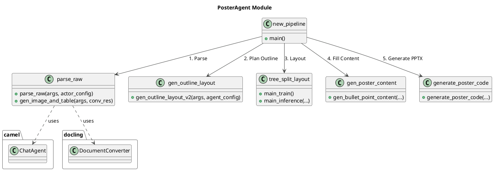

# Paper2Poster 项目解读报告

## 0. 项目概览
- **项目名称**: Paper2Poster
- **核心理念**: 一个从科研论文（PDF）到可编辑海报（PPTX）的自动化多智能体系统。其核心是`PosterAgent`，一个采用自顶向下、视觉在环（visual-in-the-loop）方法论的系统，旨在高效地将学术内容转化为视觉化、结构化的海报。
- **技术栈**: 
  - **核心框架**: Python
  - **文档解析**: `docling`, `marker` (备用)
  - **AI / Agent 框架**: `camel`
  - **LLM/VLM 支持**: OpenAI (GPT-4o), Qwen, Gemini, vLLM 本地部署模型等
  - **PPTX 操作**: `python-pptx`
  - **系统工具**: `libreoffice`, `poppler`

### 目录结构核心解读
- **`PosterAgent/`**: 项目的核心业务逻辑目录。包含了从论文解析、内容生成、布局规划到最终代码生成的所有关键流程脚本。
- **`utils/`**: 项目的工具和辅助函数目录。提供了模型配置、代码执行、PPTX操作、提示词管理等通用功能。
- **`camel/`**: 集成的第三方 Agent 框架。为项目提供了与多种 LLM/VLM 交互的标准化接口和配置管理。
- **`docling/`**: 集成的第三方文档解析库。负责将输入的 PDF 文件解析成结构化的文本、图片和表格数据。
- **`Paper2Poster-eval/`**: 评估模块，用于衡量生成海报的质量。

## 1. 项目架构设计

### 1.1. 系统整体架构
Paper2Poster 的架构可以概括为一个多阶段的流水线（Pipeline），每个阶段都由专门的模块或 Agent 负责，并深度整合了 `docling` 和 `camel` 两个关键的第三方库。

1.  **输入层 (Input Layer)**: 用户提供一篇科研论文的 PDF 文件。

2.  **解析层 (Parsing Layer - `docling`)**:
    -   该层由 `docling` 库主导。`PosterAgent/parse_raw.py` 中的 `DocumentConverter` 对象负责读取 PDF。
    -   `docling` 将 PDF 文档精准地转换为结构化数据，包括提取 Markdown 格式的纯文本、识别并抽取出所有的图片和表格，为后续处理奠定了基础。
    -   该层设计了鲁棒的备用方案：如果 `docling` 解析效果不佳（文本过短），系统会自动切换到 `marker` 库进行二次尝试。

3.  **内容规划层 (Content Planning Layer - `camel`)**:
    -   在 `docling` 完成解析后，提取出的论文文本被送入此层。
    -   该层利用 `camel` 框架。通过 `camel.models.ModelFactory` 创建一个 `ChatAgent` 实例。
    -   这个 `ChatAgent` 作为一个"作者 Agent"，负责"阅读"论文文本，并根据预设的提示词（Prompt），生成海报的宏观内容结构（如标题、章节、要点），并输出为 JSON 格式。

4.  **布局与细化层 (Layout & Refinement Layer)**:
    -   此层是 `PosterAgent` 内部的核心。它接收内容规划层生成的 JSON，并执行一系列复杂操作：
        -   **大纲与布局 (`gen_outline_layout_v2`)**: 生成海报的整体章节布局。
        -   **树状拆分布局 (`tree_split_layout`)**: 独创性地使用二叉树对海报空间进行划分，确保阅读顺序和空间平衡。
        -   **内容填充 (`gen_bullet_point_content`)**: 为每个版面（Panel）填充具体的文字内容。
        -   **代码生成 (`generate_poster_code`)**: 将最终的布局和内容信息，转换成可执行的 `python-pptx` 代码。

5.  **输出层 (Output Layer)**:
    -   执行 `python-pptx` 代码，生成最终的可编辑 `poster.pptx` 文件。

### 1.2. 整体架构 PlantUML 类图

```plantuml
@startuml
!theme vibrant
title Paper2Poster Overall Architecture

package "User" {
  actor User
}

package "Paper2Poster System" {
  node "new_pipeline.py" as Pipeline {
    
    package "PosterAgent" {
      class "parse_raw" as ParseRaw
      class "gen_outline_layout" as GenOutline
      class "tree_split_layout" as TreeLayout
      class "gen_poster_content" as GenContent
      class "generate_poster_code" as GenCode
    }

    package "utils" {
      class "wei_utils" as WeiUtils
      class "pptx_utils" as PptxUtils
    }
    
    Pipeline *-- ParseRaw
    Pipeline *-- GenOutline
    Pipeline *-- TreeLayout
    Pipeline *-- GenContent
    Pipeline *-- GenCode
    Pipeline *-- WeiUtils
  }
}

package "Third-party Libraries" {
  package "docling" {
    class "DocumentConverter"
  }
  package "camel" {
    class "ChatAgent"
    class "ModelFactory"
  }
  package "python-pptx" {
    class "Presentation"
  }
}

User --> Pipeline : "paper.pdf"

ParseRaw -> DocumentConverter : Use for PDF parsing
ParseRaw ..> ChatAgent : Provides text to
GenOutline ..> ChatAgent
GenContent ..> ChatAgent

WeiUtils --> ModelFactory : Gets model
ModelFactory --> ChatAgent : Creates model for agent

GenCode -> PptxUtils
PptxUtils -> Presentation : Generates .pptx file

Pipeline --> Presentation : > "poster.pptx"

@enduml
```

### 1.3. 模块划分与职责

-   **`PosterAgent`**: 核心流程编排。负责调用其他模块，完成从解析、规划、布局到生成海报的完整工作流。
-   **`utils`**: 通用能力支持。提供模型配置、API 封装、代码执行、PPTX 底层操作等可复用能力。
-   **`camel`**: **AI能力抽象层**。提供统一的接口来与不同的 LLMs/VLMs 进行交互，解耦了业务逻辑和具体的模型实现。
-   **`docling`**: **文档理解层**。专业的 PDF 解析器，为后续的 AI 处理提供高质量的结构化数据输入。

## 2. 核心模块分析

### 2.1. `PosterAgent` 模块

`PosterAgent` 是整个项目的指挥中心，其内部文件构成了一个清晰的生成流水线。

-   **`new_pipeline.py`**: **主流程入口**。它按顺序调用其他脚本，串联起整个海报生成过程。
    1.  调用 `parse_raw` 解析PDF。
    2.  调用 `gen_outline_layout` 规划大纲。
    3.  调用 `tree_split_layout` 进行版面划分。
    4.  调用 `gen_poster_content` 填充内容。
    5.  调用 `generate_poster_code` 生成最终的PPTX代码并执行。

-   **`parse_raw.py`**: **解析与初步规划**。
    -   **职责**: 使用 `docling` 解析 PDF，提取文本、图片和表格。然后，将文本交给 `camel.ChatAgent` 生成初步的内容大纲 (JSON)。
    -   **交互**: 强依赖 `docling` 和 `camel`。

-   **`tree_split_layout.py`**: **创新布局算法**。
    -   **职责**: 实现论文中提到的 "Binary-Tree Split" 布局算法。它将海报版面视为一个节点，通过递归地进行水平或垂直切分，将内容（文本、图片）合理地放置在叶子节点上，在保证逻辑流的同时实现了美观的布局。这是该项目的核心创新点之一。

#### `PosterAgent` PlantUML 类图


### 2.2. `utils` 模块
`utils` 模块为上层应用提供了稳定、统一的工具集。

- **`wei_utils.py`**: **核心工具集**。
    - **`get_agent_config(model_type)`**: 关键函数。该函数是 `camel` 库与项目结合的枢纽。它根据传入的模型名称（如 "4o", "vllm_qwen"），利用 `camel.types` 和 `camel.configs` 创建并返回一个标准化的 Agent 配置字典。这使得上层代码可以无差别地调用任何受支持的模型。
    - **`run_code(code)`**: 一个动态代码执行器，用于执行由 LLM 生成的 `python-pptx` 代码。

- **`pptx_utils.py`**: **PPTX 操作封装**。提供了对 `python-pptx` 库的二次封装，提供了如添加文本框、图片、设置样式等原子化操作，简化了上层的代码生成逻辑。

## 3. 设计模式与项目亮点

### 3.1. 设计模式
- **策略模式 (Strategy Pattern)**: 在 `wei_utils.py` 的 `get_agent_config` 中体现得淋漓尽致。项目将每一种 LLM/VLM 的配置封装成一个独立的"策略"（尽管这里是用 if-elif 实现的），使得上层代码可以根据需要动态切换模型，而无需改动主流程代码。
- **外观模式 (Facade Pattern)**: `PosterAgent/new_pipeline.py` 扮演了一个外观角色。它为客户端提供了一个单一的、简化的入口点，隐藏了背后多个子系统（解析、规划、布局、生成）的复杂交互。
- **模板方法模式 (Template Method Pattern)**: `camel.ChatAgent` 的使用遵循了此模式。`Paper2Poster` 负责准备数据和具体的提示词（`template.render(...)`），而 Agent 的 `step` 方法则定义了与模型交互的固定流程骨架。

### 3.2. 项目亮点
- **第三方库的深度整合**: 项目并非简单调用 `docling` 和 `camel`，而是将它们深度整合到自己的工作流中。`docling` 作为数据预处理的基石，`camel` 作为内容生成的大脑，分工明确，配合默契。
- **创新的布局算法 (`tree_split_layout`)**: 这是项目的核心技术贡献。相比于传统的模板或启发式布局，基于二叉树的递归分割方法在自动化布局方面提供了一种更灵活、更具泛化能力的解决方案。
- **代码生成作为媒介**: 项目的一大特色是它不直接操作 PPTX，而是让 LLM 生成 `python-pptx` 代码，再执行这些代码。这利用了 LLM 强大的代码生成能力，使得对海报的精细化控制（如对齐、样式、溢出处理）成为可能。
- **评估体系 (`Paper2Poster-eval`)**: 项目不仅关注"如何生成"，还关注"生成得好不好"，提供了一套评估框架，形成了完整的闭环。

## 4. 总结与建议

### 4.1. 潜在改进建议
- **配置与代码解耦**: 当前 `get_agent_config` 函数中使用大量的 if-elif 来管理模型配置。未来可以考虑将这些配置抽离到独立的 YAML 或 JSON 文件中，实现配置与代码的彻底分离，提高可维护性。
- **错误处理与重试**: 在 `parse_raw` 等关键步骤中已经使用了 `tenacity` 进行重试，这个优秀的实践可以推广到更多与 LLM 交互的环节，以应对网络波动或模型不稳定的情况。

### 4.2. 二次开发指南
- **添加新的 LLM/VLM 支持**:
  1. 在 `camel` 库中（如果需要）添加新的 ModelType 和 Config。
  2. 在 `utils/wei_utils.py` 的 `get_agent_config` 函数中，增加一个新的 `elif` 分支来处理新模型的配置。
- **自定义海报风格**:
  1. 主要修改 `PosterAgent/generate_poster_code.py` 的逻辑，调整生成 `python-pptx` 代码的模板。
  2. 也可以修改 `utils/prompt_templates` 下的 `yaml` 文件，引导 LLM 生成不同风格的内容或布局建议。
- **探索新的布局策略**:
  1. 核心是修改或替换 `PosterAgent/tree_split_layout.py`。可以尝试实现其他自动化布局算法，并使其能生成与 `new_pipeline.py` 兼容的布局数据结构。
